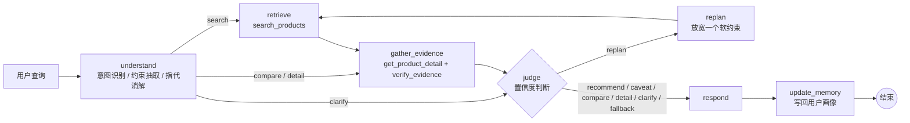

# Evidence-grounded Shopping Agent

一个基于证据做决策的多轮购物 Agent。它把用户的口语化购物需求转成结构化约束，检索候选商品，聚合并校验商品证据，再根据证据的覆盖度、冲突和置信度决定是推荐、对比、追问还是兜底。

> 个人学习项目。商品数据全部为模拟数据（`data/products.json`），链接指向 `example.com`，与任何真实平台无关。

## 解决的问题

| 问题 | 本项目的做法 |
| --- | --- |
| 复杂购物需求难以用关键词表达 | 意图识别 + 约束抽取，把品类、预算、品牌、属性转成结构化条件 |
| 多轮对话中用户约束和候选商品丢失 | 结构化工作状态 + 会话记忆（Redis checkpointer）+ 用户画像（长期记忆） |
| 证据不足时模型直接给推荐 | 证据层统一校验价格、库存、商家、时效；不可用或低置信度的商品不推荐或带提示推荐 |
| 检索为空时只会重复调用工具 | 重规划：按顺序放宽软约束；硬约束从不自动放宽，没有结果就兜底并给出最接近的选项 |
| 出了 bad case 不知道错在哪 | 每个节点、每次 skill 调用都写 trace，支持回放和错误归因 |

## 架构



- **编排**：LangGraph `StateGraph`。每个节点只读写 `AgentState`，由 `harness.guarded()` 统一计时、记录 trace、兜底异常。
- **会话记忆**：LangGraph checkpointer，按 `thread_id` 保存整个状态。配置了 `REDIS_URL` 就用 `RedisSaver`，否则用内存。
- **长期记忆**：LangGraph Store，按 `user_id` 保存用户画像（按品类记录不喜欢的品牌、预算、偏好属性）。新会话第一次出现某个品类时，用画像预填约束，并告诉用户“沿用了之前的偏好”。

## 模块

| 模块 | 职责 |
| --- | --- |
| [`harness.py`](src/shopping_agent/harness.py) | 受控执行链、路由决策、重规划、异常兜底、trace 记录 |
| [`understanding.py`](src/shopping_agent/understanding.py) | 规则版意图识别与约束抽取；跨轮约束合并（品类切换重置、排除品牌取并集、指定品牌覆盖） |
| [`llm.py`](src/shopping_agent/llm.py) | LLM 版解析器（OpenAI 兼容接口）：JSON 输出 + pydantic 校验 + 失败重试，仍失败则回退到规则 |
| [`skills.py`](src/shopping_agent/skills.py) | 5 个 skill：`search_products`、`filter_by_attributes`、`get_product_detail`、`verify_evidence`、`compare_products`。统一注册、参数校验、耗时统计，可导出 function calling schema |
| [`retrieval.py`](src/shopping_agent/retrieval.py) | 硬约束过滤 + 相关度排序 + 收缩候选池 |
| [`evidence.py`](src/shopping_agent/evidence.py) | 证据聚合：详情页价格、库存、商家评分、信息时效；冲突 / 缺失 / 过期检测；按详情页价格复核硬约束；置信度 |
| [`memory.py`](src/shopping_agent/memory.py) | 双层记忆：checkpointer（会话）+ Store（用户画像） |
| [`trace.py`](src/shopping_agent/trace.py) | trace 回放与错误归因 |
| [`eval/run_eval.py`](eval/run_eval.py) | 分层评测 |

## 快速开始

```bash
python -m venv .venv && source .venv/bin/activate
pip install -e ".[dev]"
pytest
python -m shopping_agent.cli --trace
```

对话示例（规则解析器，内存记忆）：

```text
你：想买个500以内的蓝牙耳机，不要小米
助手：根据你的要求，推荐这几款：
1. 华为 FreeBuds 6i｜499 元｜评分 4.7｜华为官方旗舰店
2. 华为 FreeBuds SE 3｜199 元｜评分 4.4｜华为官方旗舰店
3. 索尼 WF-C510｜449 元｜评分 4.5｜索尼官方旗舰店

你：第一个和第三个对比一下
助手：对比如下：……更便宜：索尼 WF-C510；评分更高：华为 FreeBuds 6i

你：有没有更便宜的
助手：（在「华为 FreeBuds 6i」（499 元）的基础上找更便宜的）……
```

漫步者 X5 Pro 列表价 489 元，但详情页是 529 元；索尼 WF-C700N 缺货。这两款都进了候选池，但被证据层拦下，没有推荐出来。

### 使用 Redis 保存会话状态

```bash
docker run -d --name redis -p 6379:6379 redis:8   # 需要 Redis 8 或 Redis Stack
pip install -e ".[redis]"
export REDIS_URL=redis://localhost:6379
python -m shopping_agent.cli
```

### 使用 LLM 做需求理解

```bash
pip install -e ".[llm]"
export LLM_API_KEY=...            # 任何 OpenAI 兼容接口
export LLM_BASE_URL=https://dashscope.aliyuncs.com/compatible-mode/v1
export LLM_MODEL=qwen-plus
python -m shopping_agent.cli
```

## 评测

```bash
python eval/run_eval.py                            # 基础用例：20 个对话，32 轮
python eval/run_eval.py --cases cases_hard.jsonl   # 口语化难例：8 个对话
python eval/run_eval.py --llm --k 3                # LLM 解析器，每个用例跑 3 次，算 pass^3
python -m shopping_agent.trace eval/results/cases_hard/failed_traces.jsonl   # 回放失败轮次
```

指标分层设计，每一层回答一个问题：

| 层次 | 指标 | 回答的问题 |
| --- | --- | --- |
| 检索 | `retrieval_recall` | 该找到的商品进候选池了吗 |
| 理解 | `constraint_extraction` | 这一句话的约束抽对了吗 |
| 记忆 | `memory_recall` | 之前说过的约束，后面还在吗 |
| 工具 | `tool_call_accuracy` | 该调的 skill 调了吗，有没有失败 |
| 决策 | `route_accuracy`、`replan_accuracy` | 推荐 / 对比 / 追问 / 兜底选对了吗，放宽的约束对吗 |
| 结果 | `hard_constraint_satisfaction` | 推荐出来的商品真的满足硬约束吗（按详情页价格算） |
| 端到端 | `pass@1`、`pass^k` | 整段对话成功了吗；多跑几次是不是每次都成功 |
| 性能 | 端到端与各节点 p50 / p95 时延 | 慢在哪 |

当前结果（规则解析器）：

| 用例集 | 约束抽取 | 记忆召回 | 硬约束满足 | 路由准确率 | 端到端 pass@1 |
| --- | --- | --- | --- | --- | --- |
| 基础用例 `cases.jsonl` | 100% | 100% | 100% | 100% | 100% |
| 口语难例 `cases_hard.jsonl` | 14% | — | 100% | 80% | 0% |

基础用例是和规则一起写的，满分只说明链路是通的，不说明泛化能力。难例覆盖中文数字（“两千”“五百块”）、“3k”、口语化排除（“别给我推小米家的”“不是苹果的”）、否定属性（“不需要降噪”）、按品牌指代（“那个华为的”）、“最后一个”。规则版在这些上几乎全错，错误归因显示 6/8 出在理解阶段，这正是接入 LLM 解析器要解决的问题。

值得注意的一点：难例里“别给我推小米家的耳机”被规则解析成了**指定**小米，推荐结果全是小米，但硬约束满足率仍是 100%，因为它满足的是被理解错的约束。所以只看结果层指标是不够的，必须同时评测理解层。

## 关键设计决策

- **硬约束和软约束分开**：品类、预算、排除品牌是硬约束，重规划时从不自动放宽；属性和指定品牌是软约束，按顺序放宽，并告诉用户放宽了什么。
- **列表价只用于粗筛，详情价才算数**：检索阶段用列表价过滤，证据层用详情价复核。价格冲突的商品会被重新判断是否超预算。
- **关键约束不参与摘要**：约束放在结构化 state 里，每轮原样带着走，不依赖对话历史，也就不会被上下文压缩丢掉。
- **“更便宜的”是相对约束**：以用户指代的商品（没有就用上一轮首推）的详情价为锚点，收紧预算上限。
- **长期偏好按品类存**：不喜欢小米耳机，不代表不看小米手机。
- **失败不抛异常**：skill 统一返回 `{"ok", "data"/"error"}`；节点异常由 harness 接住，走安全路径并记录 trace。

## 已知局限与后续计划

- [ ] 用 LLM 解析器跑难例，对比规则版的提升
- [ ] 难例扩充到 50 条以上，并按标签统计
- [ ] 消息历史目前只增不减，需要加上下文压缩
- [ ] 用户画像目前存在内存 Store，可以换成 Redis / Postgres Store
- [ ] 响应目前是模板生成，可以让 LLM 在不改动事实的前提下润色，并加“事实一致性”评测
- [ ] 检索是基于规则打分的，可以换成向量检索 + rerank

## 目录结构

```text
src/shopping_agent/   核心代码
data/products.json    模拟商品库（39 个商品，含价格冲突、缺货、信息过期、字段缺失等情况）
eval/                 评测用例与脚本
tests/                单元测试与端到端测试
docs/design.md        设计说明
```
